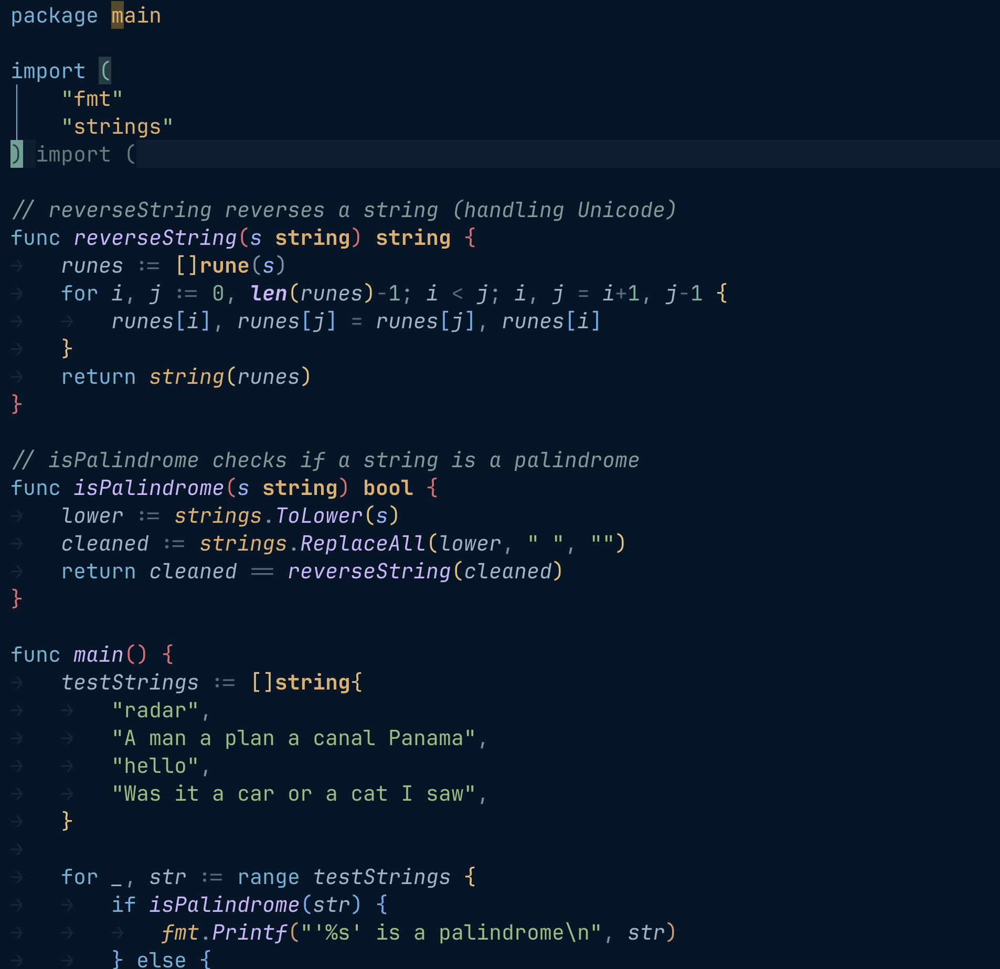
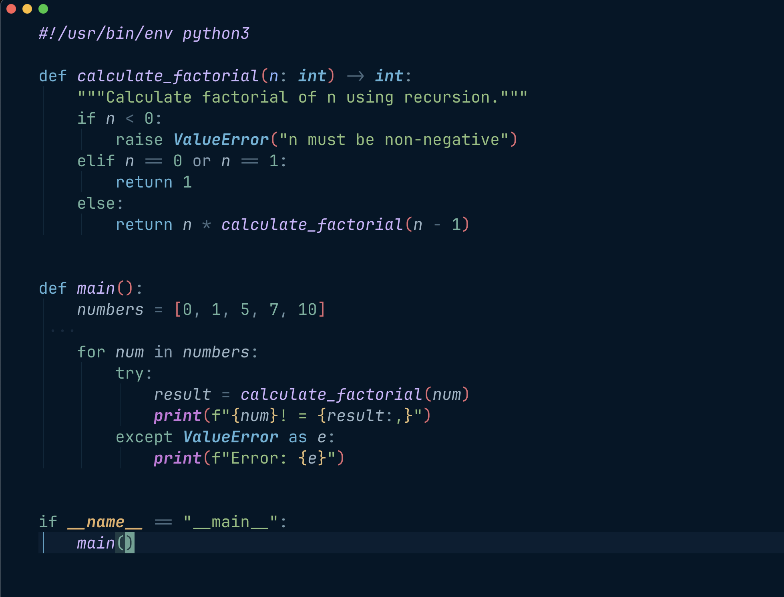
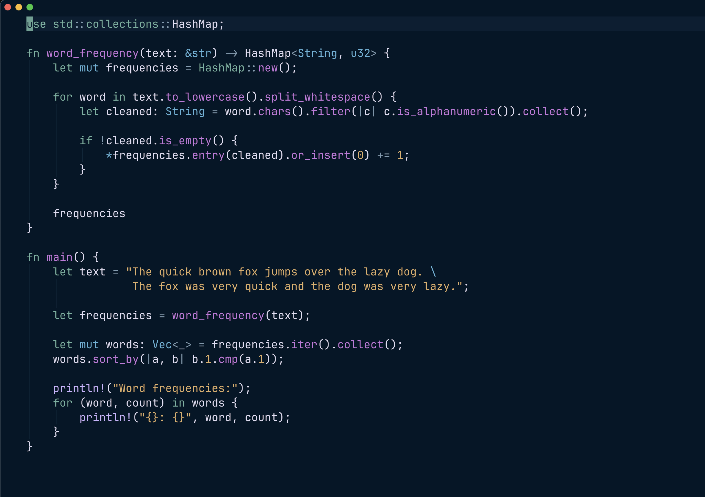
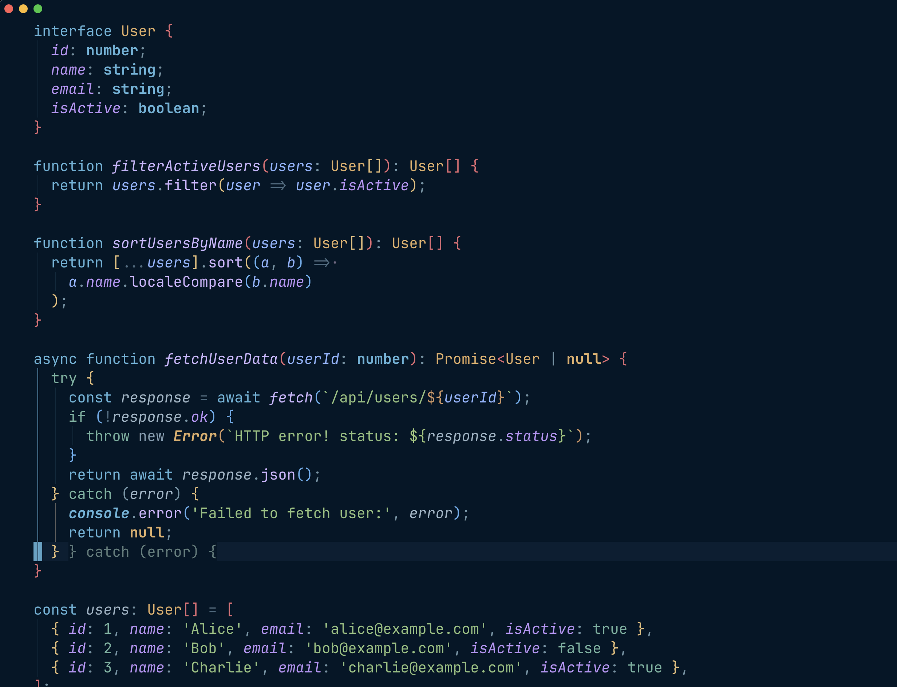
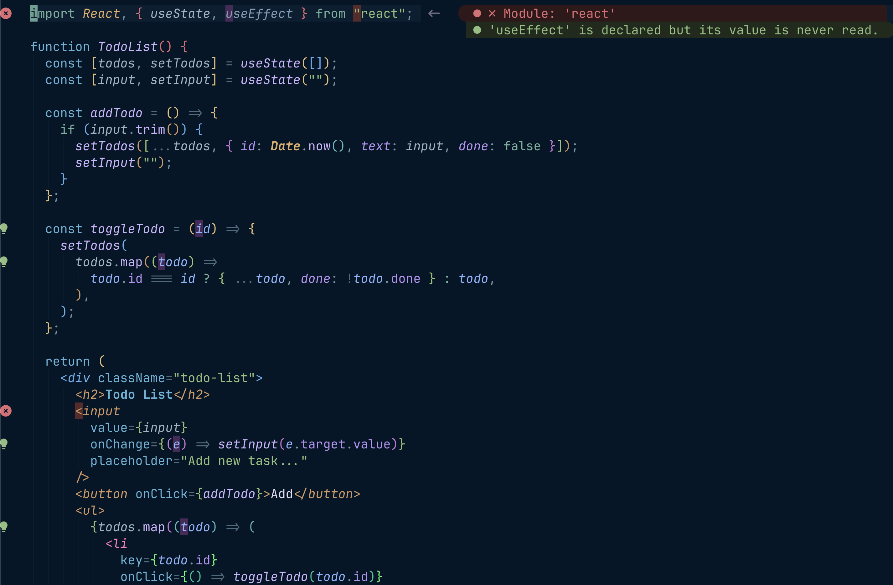

# 🌌 Midnight Neon Pine

A bespoke "Super-Theme" configuration for Neovim. This is a high-performance hybrid that merges the deep-sea comfort of **Night Owl**, the neon energy of **Tokyo Night**, and the dreamy sophistication of **Rosé Pine**.

This isn't a new plugin to maintain—it's a **Configuration Recipe** that skins the `rose-pine` engine into a high-contrast masterpiece.

## ✨ Why this hybrid?

- **The Foundation:** Locked to the authentic `#011627` background from **Night Owl**.
- **The Glow:** Functions and methods use the iconic **Night Owl** Purple (`#c792ea`).
- **The Logic:** Access modifiers (`public`, `private`) use **Rosé Pine's** pinks to separate "Control" from "Data."
- **The Recess:** Comments use the specific **Night Owl** Slate-Teal (`#637777`) so they don't distract from your code.

## 🚀 Installation (LazyVim / lazy.nvim)

Simply create or overwrite `~/.config/nvim/lua/plugins/theme.lua` with the following block:

```lua
return {
  "rose-pine/neovim",
  name = "rose-pine",
  lazy = false,
  priority = 1000,
  opts = {
    variant = "main",
    dark_variant = "main",
    styles = {
      bold = true,
      italic = true,
      transparency = false,
    },

    palette = {
      main = {
        base = "#011627", -- Night Owl Background
        surface = "#011f35",
        overlay = "#0b2942",
        muted = "#6a8080", -- Night Owl Slate Comments
        subtle = "#637777", -- Muted Steel for punctuation
        rose = "#ff7eb6", -- Metadata/Async
        pine = "#7fdbca", -- Constants/Booleans
        foam = "#7dcfff", -- Functions
        iris = "#c792ea", -- Classes/Booleans
        love = "#ff5189", -- Keywords/Flow
        gold = "#e0af68", -- Types (TokyoNight Gold)

        -- NEW PREMIUM VARIABLES
        mint = "#f2ceb6", -- Parameters (Italicized)
        olive = "#addb67", -- Strings & SQL
      },
    },

    highlight_groups = {
      -- 1. THE "CALM" ENGINE
      ["@punctuation.bracket"] = { fg = "subtle" },
      ["@punctuation.delimiter"] = { fg = "subtle" },
      ["@operator"] = { fg = "subtle" },
      ["@comment"] = { fg = "muted", italic = true },
      ["Comment"] = { fg = "muted", italic = true },

      -- 2. LOGIC FLOW (The "Love" Action)
      ["@keyword.conditional"] = { fg = "love" },
      ["@keyword.return"] = { fg = "love", italic = true, bold = true },
      ["@keyword.repeat"] = { fg = "love" },
      ["@keyword.exception"] = { fg = "love" },
      ["@keyword.function"] = { fg = "love", italic = true }, -- 'function' vs 'const'
      ["@punctuation.special"] = { fg = "love" }, -- The '*' in function*

      -- 3. STRUCTURE & METADATA
      ["@keyword.export"] = { fg = "rose", italic = true },
      ["@keyword.import"] = { fg = "rose", italic = true },
      ["@keyword.storage"] = { fg = "iris" }, -- 'const', 'let', 'static'
      ["@keyword.modifier"] = { fg = "rose", italic = true }, -- 'async', 'readonly'

      -- 4. THE BLUEPRINT (Gold Hierarchy)
      ["@type"] = { fg = "gold", bold = true },
      ["@type.builtin"] = { fg = "iris" },
      ["@type.interface"] = { fg = "gold", bold = true },
      ["@variable.parameter"] = { fg = "mint", italic = true },

      -- 5. ACTION (Foam for Functions)
      ["@function"] = { fg = "foam" },
      ["@function.method"] = { fg = "foam" },
      ["@function.call"] = { fg = "foam" },
      ["@property"] = { fg = "iris" },
      ["@variable.member"] = { fg = "iris" },

      -- 6. DATA (Olive for Strings)
      ["@constant"] = { fg = "pine" },
      ["@boolean"] = { fg = "pine" },
      ["@string"] = { fg = "olive" },

      -- 7. UI ACCENTS
      Visual = { bg = "#1b2e3f", inherit = false },
      CursorLine = { bg = "#081d2f" },
      LineNr = { fg = "#3b4261" },
      CursorLineNr = { fg = "foam", bold = true },
      WinSeparator = { fg = "#0b2942", bg = "NONE" },

      -- LSP Overrides for separation
      ["@lsp.type.type"] = { link = "@type" },
      ["@lsp.type.interface"] = { link = "@type.interface" },
      ["@lsp.type.function"] = { link = "@function" },
      ["@lsp.type.method"] = { link = "@function.method" },
      ["@lsp.type.parameter"] = { fg = "mint", italic = true },
      ["@lsp.type.variable"] = { fg = "subtle" }, -- Mutes regular variables
    },
  },
  config = function(_, opts)
    require("rose-pine").setup(opts)
    vim.cmd("colorscheme rose-pine")

    vim.api.nvim_create_autocmd({ "BufEnter", "BufWinEnter" }, {
      pattern = { "*.ts", "*.tsx", "*.js", "*.jsx", "*.lua" },
      callback = function()
        vim.fn.matchadd("CoroutineKeyword", "\\<yield\\>", 100)
        vim.fn.matchadd("CoroutineKeyword", "\\<await\\>", 100)
        vim.fn.matchadd("CoroutineKeyword", "\\<async\\>", 100)
      end,
    })

    vim.api.nvim_set_hl(0, "CoroutineKeyword", { fg = "#ff7eb6", italic = true })
  end,
}
```

## 📸 Screenshots

### Go


### Python


### Rust


### TypeScript


### React (TSX)

